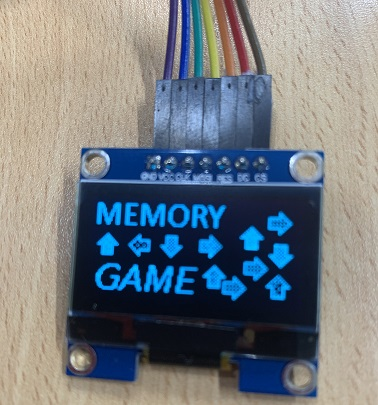

# Memory Gesture Game
This project is all about creating a simple game to test your memory.

Using the well-known gesture sensor module ([XC3742](https://jaycar.com.au/p/XC3742)) and OLED Screen ([XC3728](https://jaycar.com.au/p/XC3728)) it will show patterns on the screen comprising of left, up, right, down, circle, and wave; try to match the patterns with your own hand! First level is short and easy to follow but it will get progressively faster and more complicated as you advance through the levels.

Play this game with your friends and see how far you can get.

## Bill of Materials

| Qty | Code                                     | Description              |
| --- | ---------------------------------------- | ------------------------ |
| 1   | [XC4410](https://jaycar.com.au/p/XC4410) | UNO compatible board     |
| 1   | [XC3728](https://jaycar.com.au/p/XC3728) | OLED display             |
| 1   | [XC3742](https://jaycar.com.au/p/XC3742) | Gesture sensor           |
| 1   | [WC6028](https://jaycar.com.au/p/WC6028) | Plug socket jumper leads |

This is a relatively simple game to build, but if you wanted to make it more featureful:

| Code                                     | Name                     | Reasoning                                                                             |
| ---------------------------------------- | ------------------------ | ------------------------------------------------------------------------------------- |
| [XC4424](https://jaycar.com.au/p/XC4424) | Buzzer Module            | Add some audio feedback in the game, to bzzt and zap when players get it wrong or not |
| [XC4385](https://jaycar.com.au/p/XC4385) | Circular LED module      | A nice RGB circular display for effects and gestures                                  |
| [XC3714](https://jaycar.com.au/p/XC3714) | 7 Segment Display Module | Show the current and high scores just like one of those retro arcade machines         |
| [XC3748](https://jaycar.com.au/p/XC3748) | MP3 module               | For the truely advanced, make your own mini version of DDR by adding this MP3 module  |

Although, if you're going to add some extra features, it might be best to use a bigger microcontroller, as the Atmel 328p is nearing it's size in this project.

## How it works

Relatively simple game with a state machine; each of the pattern arrays are stored in flash memory so it leaves the working memory for the gesture sensor; We have also patched and improved the gesture sensor library, so be sure to use the very latest from github (https://github.com/Seeed-Studio/Gesture_PAJ7620). We have included the library in this folder which should work for you.

We had to work this code a little bit to make it fit on the UNO, if there's any glaring improvements you can see, feel free to submit a contribution to the code!

## How to build

For full build instructions, check out the website: https://jaycar.com.au/memory-gesture-game

## How to use

When you're on the title screen; wipe your hand over it to start the game.

It will then show you a pattern that you must memorise; after the pattern it will display "GO!" and you must replicate the pattern using the gesture sensor. You can make 5 mistakes for the entire length of the pattern, then it's game over; otherwise you move to the next level, which is a little faster, and longer, than the last.

To cheat and see the levels, check out `levels.h` file.